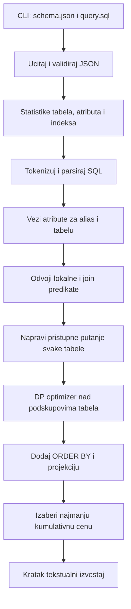
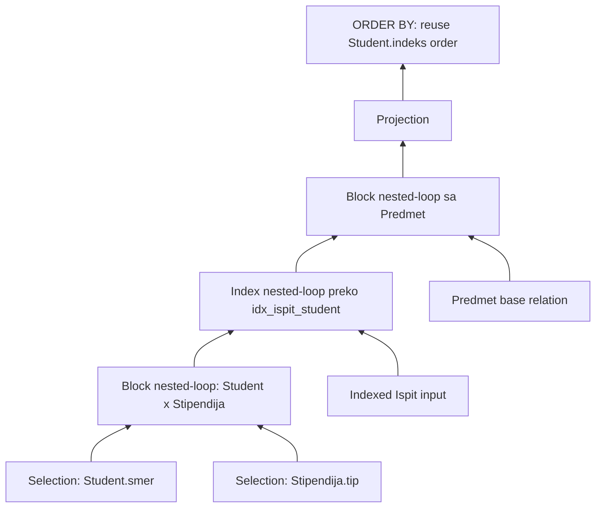

# Arhitektura i tok izvrsavanja

## Tok od pokretanja do rezultata



1. `cli.py` podrazumevano cita `schema.json` i `query.sql` iz root foldera, a
   opcijama `--schema` i `--query` mogu se zadati drugi fajlovi. Zatim poziva
   `estimate_file`.
2. `schema_loader.py` proverava obavezna polja, konzistentnost statistika,
   atribute indeksa i tip indeksa. Zvanicna camelCase polja (`bufferBlocks`,
   `rowCount`, `distinctValues`, `treeHeight`) normalizuje u tipizovane Python
   modele, a `B_PLUS_TREE` i `HASH` u interne vrste indeksa.
3. `sql_parser.py` pretvara SQL u tok tokena, gradi ograniceno sintaksno stablo
   i svaki atribut vezuje za kanonski alias. Dvosmislen ili nepoznat atribut je
   greska pre optimizacije.
4. Predikati sa jednom tabelom postaju lokalne selekcije. Predikati sa dve
   tabele postaju grane join grafa.
5. `access_paths.py` za svaku baznu tabelu procenjuje sekvencijalni pristup i
   svaki primenljiv indeks. Cuva najjeftiniju putanju za svaki zanimljiv
   izlazni redosled.
6. `optimizer.py` dinamickim programiranjem nalazi redosled spajanja i fizicki
   algoritam. Sve cene ukljucuju materijalizaciju izlaza.
7. Posle join-a se dodaju projekcija i `ORDER BY`. Ako je redosled vec dobijen
   clustered B+ pristupom, sort-merge join-om ili nested-loop planom koji cuva
   spoljasnji redosled, sortiranje kosta nula.
8. `reporting.py` postorder obilaskom ispisuje operacije redom kojim se
   izvrsavaju. Za svaku prikazuje algoritam i cenu, pa ukupnu cenu plana.

## Dinamicko programiranje

Za najvise cetiri tabele broj podskupova je mali, pa se mogu ispitati sve
particije bez heuristickog skracivanja pretrage.

```mermaid
flowchart LR
    A[Planovi za jednu tabelu] --> B[Podskupovi velicine 2]
    B --> C[Podskupovi velicine 3]
    C --> D[Podskup velicine 4]
    D --> E[ORDER BY i projekcija]

    P[Za svaku particiju L | R] --> Q[Tuple NLJ]
    P --> R[Block NLJ]
    P --> S[Index NLJ]
    P --> T[Sort-merge]
    P --> U[Hash join]
    Q --> V[Zadrzi minimum po izlaznom redosledu]
    R --> V
    S --> V
    T --> V
    U --> V
```

Stanje DP-a sadrzi:

- skup vec spojenih tabela;
- procenjeni broj redova i blokova;
- `V(A)` za svaki atribut;
- ukupnu cenu do tog stanja;
- opcioni atribut i smer sortiranja;
- koren fizickog stabla plana.

Ne cuva se samo apsolutno najjeftiniji plan. Za svaki podskup se cuva minimum
za `(bez reda)`, `(A, ASC)`, `(A, DESC)` i druge redove koji se pojave. To je
princip zanimljivih redosleda: lokalno skuplji plan moze izbeci skupo zavrsno
sortiranje.

## Model statistika

Koristi se sledeca notacija:

- $T(R)$ - broj redova relacije $R$;
- $B(R)$ - broj disk blokova relacije $R$;
- $V(A,R)$ - broj razlicitih vrednosti atributa $A$;
- $M$ - broj raspolozivih bafer blokova;
- $B(O)$ - broj blokova materijalizovanog izlaza operatora.

Za izlaz dobijen racunanjem koristi se:

$$
B(O) = \left\lceil\frac{T(O) \cdot width(O)}{estimatedBlockBytes}\right\rceil
$$

Za filtriranu baznu tabelu, gde je poznat `rowsPerBlock`, koristi se
$\lceil T(O)/rowsPerBlock \rceil$. Posto ulaz ne sadrzi sirine, koriste se
`STRING=32`, `DOUBLE=8`, `INT=4` i `DATE=4` bajta. `estimatedBlockBytes` se
procenjuje kao medijana vrednosti `sirina reda * rowsPerBlock` svih tabela.

### Selektivnost

Za jednakost sa konstantom:

$$
sel(A=c)=\frac{1}{V(A,R)}
$$

Za nejednakost se koristi $1-1/V(A,R)$, a za `<`, `<=`, `>` i `>=` vrednost
$1/3$. Za spoj jednakosti:

$$
sel(R.A=S.B)=\frac{1}{\max(V(A,R),V(B,S))}
$$

Selektivnosti konjunktivnih uslova se mnoze. Procena se ogranicava na opseg od
nula do ulaznog broja redova.

## Cene operatora

Sve formule ispod ukljucuju upis materijalizovanog izlaza $B(O)$.

### Selekcija

Sekvencijalni prolaz:

$$
C_{scan}=B(R)+B(O)
$$

B+ stablo visine $h$:

$$
C_{B+}=h+B(dataPages)+B(O)
$$

Hash indeks:

$$
C_{hash}=1+B(dataPages)+B(O)
$$

Za clustered indeks broj stranica podataka je priblizno broj uzastopnih
izlaznih blokova. Za unclustered indeks je najvise jedan blok po pogodjenom
redu, ograniceno sa $B(R)$.

### Spoljno objedinjeno sortiranje

Pocetni broj sortiranih nizova je:

$$
r_0=\left\lceil\frac{B(R)}{M}\right\rceil
$$

Svaki merge prolaz spaja najvise $M-1$ nizova. Ako je potrebno $p$ merge
prolaza:

$$
C_{sort}=2B(R)(1+p)
$$

Za ulaz veci od bafera potrebno je $M\ge 3$.

### Spajanje

Tuple nested-loop, gde je $R$ spoljasnja relacija:

$$
C_{TNLJ}=B(R)+T(R)B(S)+B(O)
$$

Block nested-loop:

$$
C_{BNLJ}=B(R)+\left\lceil\frac{B(R)}{M-2}\right\rceil B(S)+B(O)
$$

Index nested-loop:

$$
C_{INLJ}=B(R)+T(R)(C_{probe}+B(matchesPerProbe))+B(O)
$$

Sort-merge join:

$$
C_{SMJ}=C_{sort}(R)+C_{sort}(S)+B(R)+B(S)+B(O)
$$

Ako je jedan ulaz vec sortiran po join kljucu, njegova sort cena je nula.

One-pass hash join je primenljiv kada manja relacija staje u $M-2$ blokova:

$$
C_{1hash}=B(R)+B(S)+B(O)
$$

Grace hash join sa jednim particionim nivoom je primenljiv kada manja relacija
ima najvise $(M-1)(M-2)$ blokova:

$$
C_{Grace}=3(B(R)+B(S))+B(O)
$$

### Projekcija

Projekcija ne uklanja duplikate, cita ceo ulaz i upisuje uzi rezultat:

$$
C_{projection}=B(R)+B(O)
$$

## Primer izabranog plana

Za dostavljeni [schema.json](../schema.json) i [query.sql](../query.sql) nad sve
cetiri tabele sistem bira sledeci oblik:



Clustered B+ stablo nad `Student.indeks` znaci da sekvencijalna selekcija daje
studente po indeksu. Prvi block nested-loop koristi studente kao spoljasnji
ulaz, index nested-loop zatim cuva red spoljasnjeg rezultata, a i zavrsni block
nested-loop ga cuva. Zato `ORDER BY s.indeks` nema dodatnu I/O cenu. Procena je
200 izlaznih redova, 30 blokova i ukupno 1451 blok transfer.

## Pretpostavke i granice modela

- CPU, memorijska poredjenja, kesiranje i paralelizam se ne naplacuju.
- Raspodele su uniformne, a uslovi nezavisni.
- Ne postoje histogrami, strani kljucevi ni informacije o korelaciji.
- Cena B+ listova i hash bucket overflow stranica nije poznata iz ulaza i
  obuhvacena je uproscenim troskom probe.
- Hash join pretpostavlja ravnomerno particionisanje.
- Sirine tipova i korisna velicina bloka se procenjuju jer ih zvanicni JSON ne
   sadrzi.
- Svaki logicki operator materijalizuje izlaz, sto je zahtev projekta.
- Procena je deterministicka i edukativna; nije zamena za statisticki model
  produkcionog DBMS-a.
